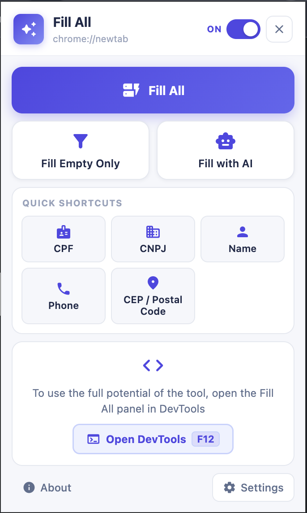
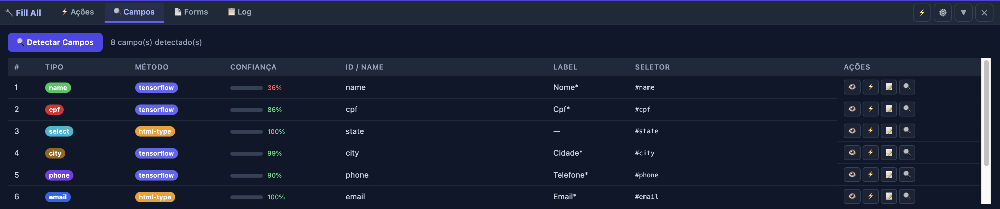
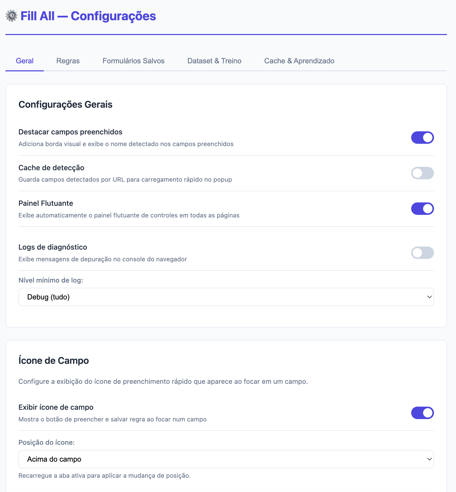
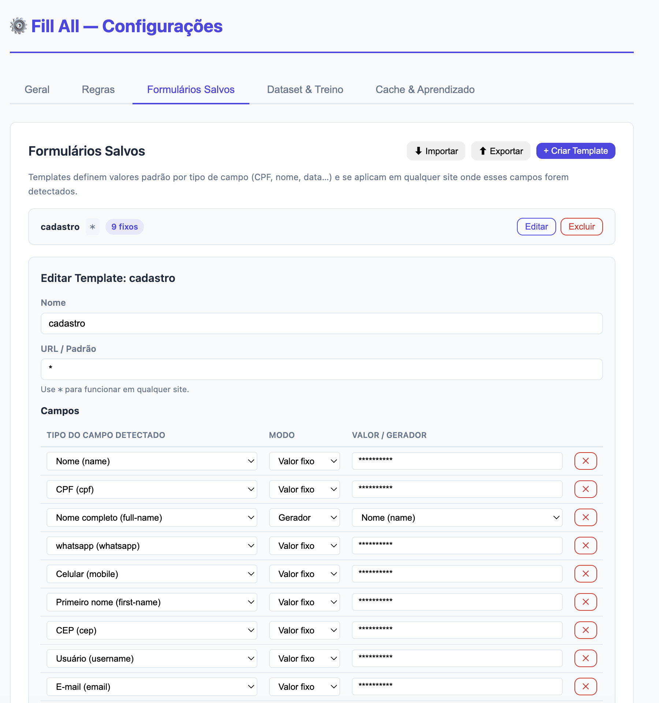
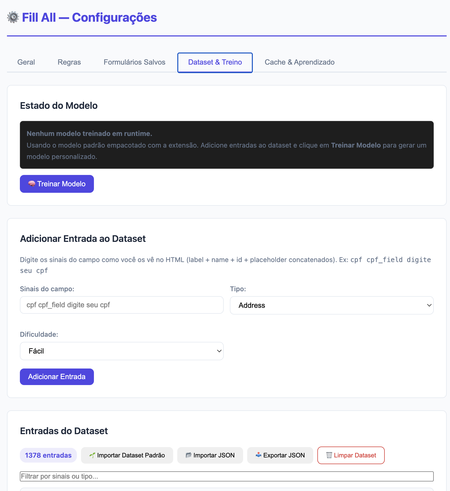
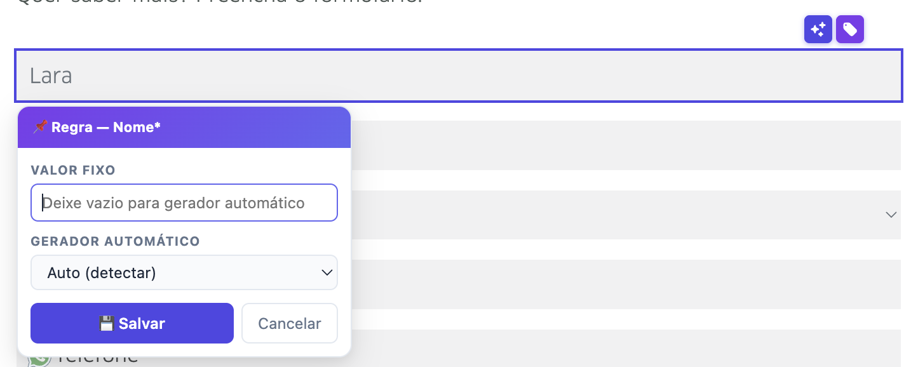

<div align="center">

# Fill All

**Extensão Chrome para preenchimento automático inteligente de formulários**

[](https://developer.chrome.com/docs/extensions/)
[](https://developer.chrome.com/docs/extensions/develop/migrate/what-is-mv3)
[](https://www.typescriptlang.org/)
[](https://www.tensorflow.org/js)
[](LICENSE)

[Funcionalidades](#-funcionalidades) · [Instalação](#-instalação) · [Documentação](docs/) · [Contribuindo](docs/contributing.md)

</div>

---

## 📖 Sobre

Fill All é uma extensão Chrome de código aberto que preenche formulários automaticamente usando **inteligência artificial** e **geradores de dados brasileiros válidos**. Combina Chrome Built-in AI (Gemini Nano), TensorFlow.js e um motor de regras configurável para classificar campos e gerar dados realistas — CPF, CNPJ, RG, CEP, telefone e muito mais.

**Ideal para**: desenvolvedores, QAs, testers e qualquer pessoa que preenche formulários repetidamente.

## 📸 Screenshots

<div align="center">

### Popup


### Painel Flutuante (in-page)


### DevTools Panel


### Options Page

| Configurações Gerais | Formulários Salvos | Dataset de Treinamento |
|:---:|:---:|:---:|
|  |  |  |

### Adicionar Regra


</div>

## ✨ Funcionalidades

### Inteligência Artificial
- **Chrome Built-in AI** (Gemini Nano) — classificação nativa de campos via LLM local
- **TensorFlow.js** — classificador MLP treinado com dataset de campos brasileiros
- **Aprendizado contínuo** — predições do Chrome AI alimentam o modelo TensorFlow.js
- **Treinamento no browser** — treine modelos customizados direto na Options Page

### Dados Brasileiros Válidos
- **CPF/CNPJ** com dígitos verificadores corretos
- **RG, CNH, PIS, Passaporte**
- **CEP, endereços, cidades e estados**
- **Telefones** com DDDs válidos e formato brasileiro
- **PIX keys, cartões de crédito**
- **Nomes completos** em português

### Automação Inteligente
- **Pipeline de detecção** composável e imutável (HTML → Keyword → TensorFlow → Chrome AI)
- **Regras por site** — configure comportamento específico por URL e seletor CSS
- **Formulários salvos** — salve e reutilize dados entre sessões
- **DOM Watcher** — detecta novos campos em SPAs em tempo real
- **Adaptadores de UI** — suporte nativo a Ant Design, Select2 e componentes custom

### Interface
- **Popup** — controle rápido com um clique
- **Options Page** — configuração completa (regras, dataset, treinamento)
- **DevTools Panel** — inspeção em tempo real para desenvolvedores
- **Floating Panel** — controles in-page com abas
- **Atalho**: `Alt+Shift+F` (Mac: `Cmd+Shift+F`)
- **Menu de contexto**: clique direito → "Fill All"

## 🚀 Instalação

### Pré-requisitos

- **Node.js** 18+
- **npm** 9+
- **Chrome** 128+ (para Chrome AI: Chrome 131+)

### Build

```bash
git clone https://github.com/marcuspmd/fill-all.git
cd fill-all
npm install
npm run build
```

### Carregar no Chrome

1. Abra `chrome://extensions/`
2. Ative o **Modo de desenvolvedor**
3. Clique em **Carregar sem compactação**
4. Selecione a pasta `dist/`

### Desenvolvimento

```bash
npm run dev          # Build com HMR (hot module replacement)
npm run type-check   # Verificação de tipos
npm run train:model  # Treinar modelo TensorFlow.js
```

### Chrome Built-in AI (Opcional)

Para usar o Gemini Nano local (Chrome 131+):

1. Abra `chrome://flags`
2. Ative `#prompt-api-for-gemini-nano`
3. Reinicie o Chrome

> Sem essa flag, o fallback para TensorFlow.js será usado automaticamente.

## 🏗️ Arquitetura

```
┌─────────────┐     ┌──────────────────┐     ┌──────────────────┐
│  Popup UI   │────▶│    Background     │◀────│  Content Script  │
│             │     │  (Service Worker) │     │  (DOM + Forms)   │
└─────────────┘     └────────┬─────────┘     └────────┬─────────┘
                             │                        │
┌─────────────┐    ┌─────────┼─────────┐    ┌─────────┼─────────┐
│  Options    │    │         │         │    │         │         │
│   Page      │    ▼         ▼         ▼    ▼         ▼         │
└─────────────┘  Storage   Rules    AI    Form     DOM        │
                   │       Engine  Modules Detector Watcher     │
┌─────────────┐    │                │                           │
│  DevTools   │    │       ┌────────┴────────┐                  │
│   Panel     │    │       ▼                 ▼                  │
└─────────────┘    │   Chrome AI      TensorFlow.js             │
                   │  (Gemini Nano)    (Classifier)             │
                   │                                            │
                   └────────────────────────────────────────────┘
```

> Documentação detalhada da arquitetura em [docs/architecture.md](docs/architecture.md)

## 📂 Estrutura do Projeto

```
fill-all/
├── src/
│   ├── background/          # Service Worker (message routing)
│   │   └── handlers/        # Domain handlers (rules, cache, dataset, learning)
│   ├── content/             # Content Script (DOM operations)
│   ├── popup/               # Popup UI
│   ├── options/             # Options Page (settings, rules, dataset, training)
│   ├── devtools/            # Chrome DevTools Panel
│   └── lib/
│       ├── ai/              # Chrome AI + TensorFlow.js + Learning Store
│       ├── form/            # Detecção, classificação e preenchimento
│       │   ├── detectors/   # Pipeline imutável + classificadores
│       │   ├── extractors/  # Extratores de sinais (label, selector, signals)
│       │   └── adapters/    # Adaptadores de UI (Ant Design, Select2)
│       ├── generators/      # Geradores de dados (CPF, CNPJ, etc.)
│       ├── dataset/         # Dataset de treinamento + runtime dataset
│       ├── storage/         # Chrome Storage (rules, forms, settings, cache)
│       ├── rules/           # Motor de regras por URL
│       ├── messaging/       # Validação de mensagens (Zod + light)
│       ├── shared/          # Utilitários (signals, ngram, field catalog)
│       ├── ui/              # Rendering helpers (badges, tables, colors)
│       ├── url/             # URL pattern matching
│       ├── chrome/          # Chrome API utilities
│       └── logger/          # Sistema de logging centralizado
├── scripts/                 # Scripts offline (train model, import rules)
├── public/model/            # Modelo TF.js pré-treinado
├── docs/                    # Documentação detalhada
├── manifest.json            # Chrome Extension Manifest V3
├── vite.config.ts           # Vite + @crxjs/vite-plugin
└── tsconfig.json            # TypeScript strict
```

## 🔄 Fluxo de Preenchimento

```
Usuário aciona ──▶ Background roteia ──▶ Content Script detecta campos
                                              │
                                    ┌─────────▼──────────┐
                                    │  Para cada campo:   │
                                    │                     │
                                    │  1. Campo ignorado? │──▶ Skip
                                    │  2. fixedValue?     │──▶ Valor fixo
                                    │  3. Form salvo?     │──▶ Template
                                    │  4. Chrome AI?      │──▶ Gemini Nano
                                    │  5. TensorFlow.js?  │──▶ Classificar + Gerar
                                    │  6. Fallback        │──▶ Gerador padrão
                                    └─────────┬──────────┘
                                              │
                                    Preenche + dispara eventos
                                    (input/change/blur)
```

## 📋 Scripts Disponíveis

| Comando | Descrição |
|---------|-----------|
| `npm run dev` | Build com HMR para desenvolvimento |
| `npm run build` | Build de produção → `dist/` |
| `npm run type-check` | Verificação de tipos (`tsc --noEmit`) |
| `npm run train:model` | Treina modelo TensorFlow.js com dataset |
| `npm run import:rules` | Importa regras exportadas para o dataset |
| `npm run clean` | Limpa a pasta `dist/` |

## 🛠️ Stack Tecnológica

| Camada | Tecnologia | Propósito |
|--------|-----------|-----------|
| **Build** | Vite 7.3 + @crxjs/vite-plugin | Bundling moderno com HMR |
| **Linguagem** | TypeScript ES2022 (strict) | Type safety |
| **AI Nativa** | Chrome Prompt API (Gemini Nano) | Classificação via LLM local |
| **ML** | TensorFlow.js 4.22 | Classificação client-side |
| **Validação** | Zod v4 | Schema validation |
| **Dados** | @faker-js/faker | Geração de dados realistas |
| **Storage** | Chrome Storage API (local) | Persistência local |
| **Extensão** | Manifest V3 | Padrão moderno de extensões |

## 📚 Documentação

| Documento | Descrição |
|-----------|-----------|
| [Arquitetura](docs/architecture.md) | Visão geral da arquitetura, comunicação entre módulos e padrões |
| [Módulos](docs/modules.md) | Referência completa de todos os módulos e suas APIs |
| [Pipeline AI](docs/ai-pipeline.md) | Como funciona a classificação de campos e o treinamento de modelos |
| [Geradores](docs/generators.md) | Todos os geradores de dados disponíveis e como criar novos |
| [Contribuindo](docs/contributing.md) | Guia completo para contribuidores |
| [Roadmap](docs-md/roadmap.md) | Funcionalidades planejadas e melhorias futuras |

## 🤝 Contribuindo

Contribuições são muito bem-vindas! Veja o [Guia de Contribuição](docs/contributing.md) para detalhes sobre:

- Como configurar o ambiente de desenvolvimento
- Convenções de código e padrões do projeto
- Como criar novos geradores, detectores ou adaptadores
- Processo de pull request

## 📄 Licença

Este projeto é licenciado sob a [Licença MIT](LICENSE).
