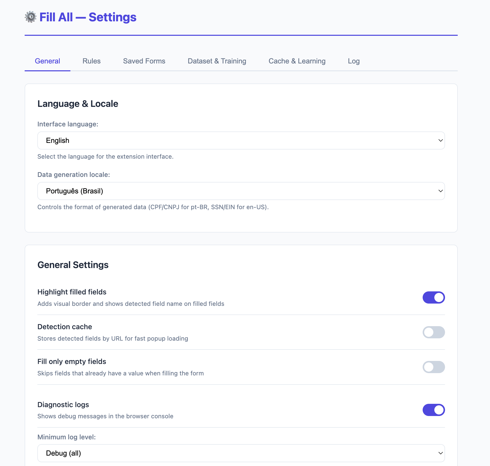
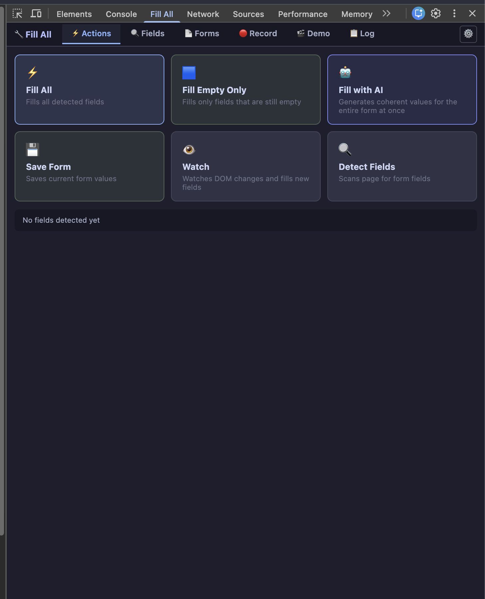
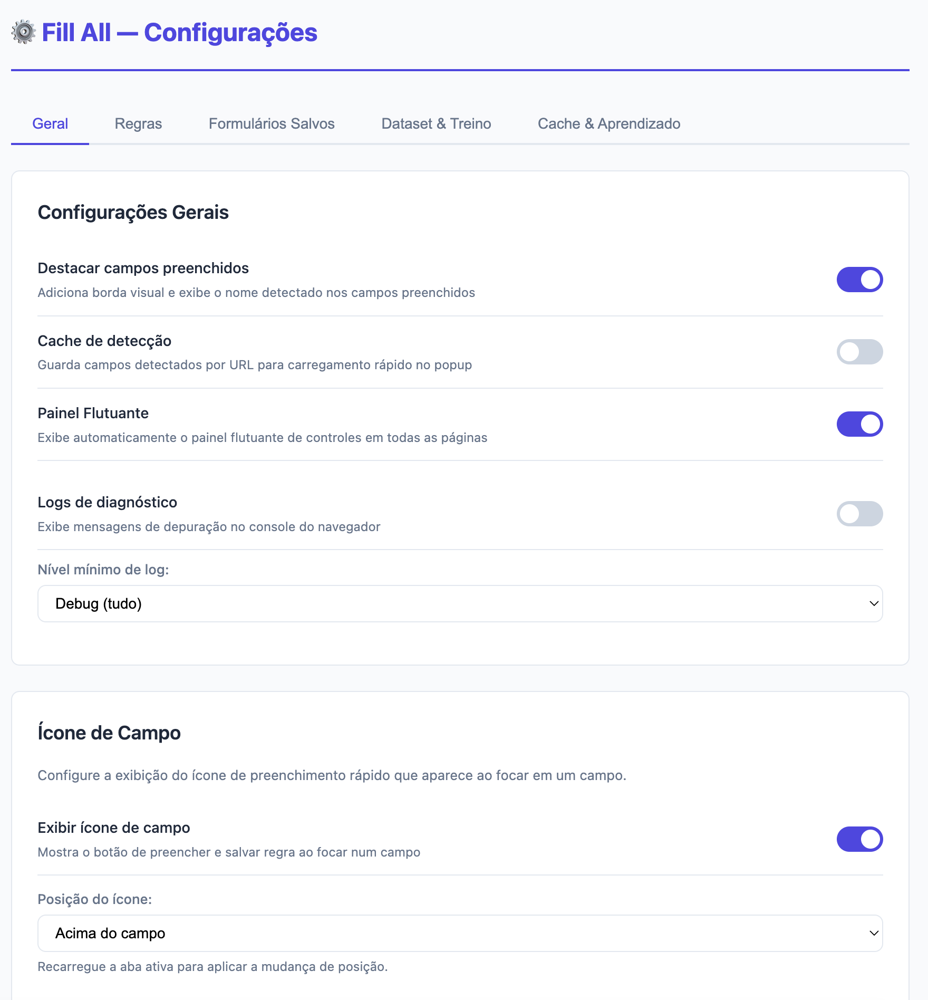
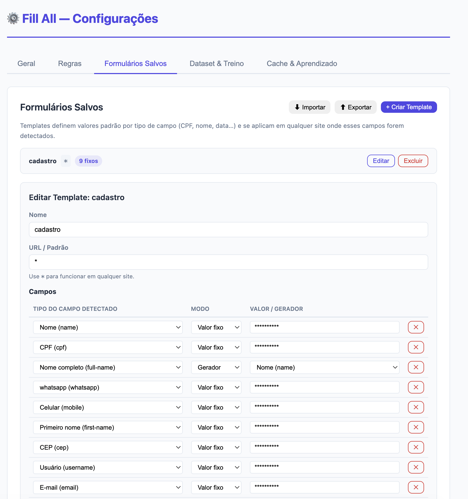
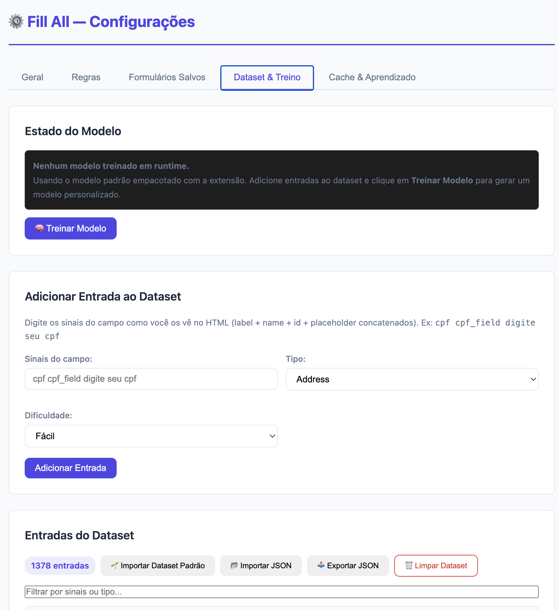
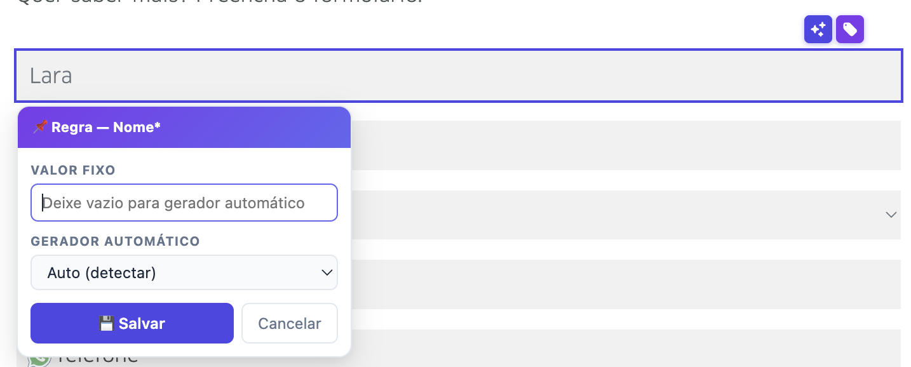
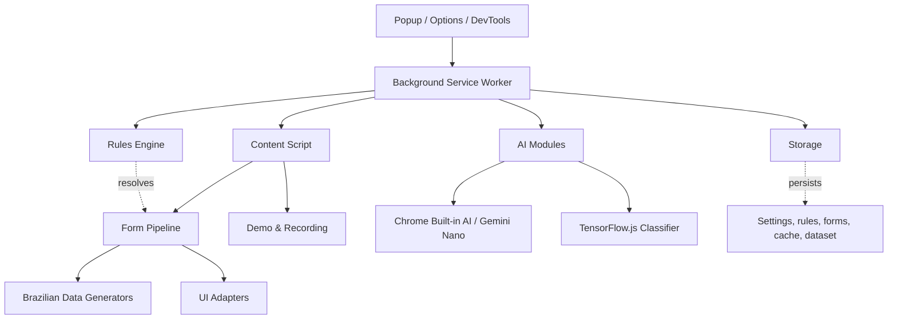

<div align="center">

# Fill All

**AI-powered Chrome extension for smart form filling, recording, and demo generation**


[](https://deepwiki.com/marcuspmd/fill-all)
[](https://developer.chrome.com/docs/extensions/)
[](https://chromewebstore.google.com/detail/fill-all/djnkgmelgfdjpeacmolelikhgioendjh)
[](https://developer.chrome.com/docs/extensions/develop/migrate/what-is-mv3)
[](https://www.typescriptlang.org/)
[](https://www.tensorflow.org/js)
[](LICENSE)

[Chrome Web Store](https://chromewebstore.google.com/detail/fill-all/djnkgmelgfdjpeacmolelikhgioendjh) · [Features](#features) · [Getting started](#getting-started) · [Documentation](#documentation) · [Security](SECURITY.md) · [Contributing](docs-md/contributing.md)

</div>

---

## Overview

Fill All is an open-source Chrome extension that fills web forms using a layered pipeline of:

- **rules and saved templates**
- **built-in generators for valid Brazilian data**
- **TensorFlow.js field classification**
- **Chrome Built-in AI / Gemini Nano for contextual filling**

It is built for developers, QA engineers, automation teams, and anyone tired of filling the same form repeatedly.

Everything runs **locally in the browser**. No external AI API is required for the built-in AI and machine-learning flows.

Install from the Chrome Web Store:

- https://chromewebstore.google.com/detail/fill-all/djnkgmelgfdjpeacmolelikhgioendjh

## Screenshots

<div align="center">

### Settings


### DevTools Panel


### Options Page

| Settings | Saved Forms | Dataset |
|:---:|:---:|:---:|
|  |  |  |

### Add Rule From a Field


</div>

## Features

### Smart filling pipeline

- **Rule-first filling** with fixed values or generator-specific parameters
- **Saved forms/templates** for repeatable fills per site or URL pattern
- **Fill only empty fields** mode
- **Ignored fields** support
- **DOM watcher** for SPAs and dynamic forms
- **Custom UI adapters** for components such as Ant Design and Select2

### AI and ML

- **Contextual AI fill** from the popup using:
  - free-text context
  - CSV uploads
  - image uploads
  - PDF uploads
- **TensorFlow.js classifier** trained for field detection in-browser
- **Chrome Built-in AI / Gemini Nano** integration when available
- **Continuous learning loop** from user activity and rules
- **Runtime retraining** from the options page

### Brazilian data generators

- CPF and CNPJ with valid check digits
- RG, CNH, PIS, passport, and related document helpers
- names, company names, emails, phone numbers, PIX keys, addresses, ZIP codes, and more
- adaptive generation that respects input constraints such as `maxlength`, `pattern`, and numeric ranges

### Developer tooling

- **DevTools panel** with tabs for `actions`, `fields`, `forms`, `record`, `demo`, and `log`
- **Interaction recording** with start, pause, resume, stop, clear, and inline step editing
- **E2E export** for Playwright, Cypress, and Pest/Dusk-style flows
- **Optional AI optimization** for exported scripts
- **Demo flow generation** from recordings
- **Replay controls** with progress tracking, speed presets, captions, assertions, and visual effects
- **Replay video recording** using Chrome tab capture and `MediaRecorder`

### Privacy-first by design

- local-only storage with `chrome.storage.local`
- no analytics or telemetry built into the extension
- on-device AI and browser-side ML flows

## Getting started

### Requirements

- **Node.js** 18+
- **npm** 9+
- **Chrome** 128+
- **Chrome 131+** recommended for Chrome Built-in AI features

### Install dependencies

```bash
git clone https://github.com/marcuspmd/fill-all.git
cd fill-all
npm install
```

### Build the extension

```bash
npm run build
```

### Load it in Chrome

1. Open `chrome://extensions/`
2. Enable **Developer mode**
3. Click **Load unpacked**
4. Select the generated `dist/` directory

## How to use

### Popup

The popup intentionally stays small and fast. It currently exposes four primary actions:

- **Fill All**
- **Fill Contextual AI**
- **Fill Only Empty**
- **Settings**

### Options page

The options page is the configuration hub and includes:

- settings
- rules
- forms
- cache
- dataset
- log

### DevTools panel

The DevTools panel is where the heavier tooling lives:

- inspect detected fields
- manage recordings
- export generated test scripts
- create and replay demo flows
- review logs and runtime behavior

### Keyboard shortcut

- **Windows/Linux**: `Alt+Shift+F`
- **macOS**: `Command+Shift+F`

## Contextual AI fill

The contextual AI flow fills the form as a whole instead of generating each field in isolation.

Current behavior:

- gathers eligible fields from the page
- builds a single batched request for the form
- can include optional user context from text, CSV, image, or PDF input
- keeps values cohesive across fields when AI is available
- falls back to the standard filling pipeline when AI is unavailable or returns no usable result

## Architecture at a glance


```mermaid
flowchart TD
  UI["Popup / Options / DevTools"] --> BG["Background Service Worker"]
  BG --> CS["Content Script"]

  BG --> ST["Storage"]
  BG --> RU["Rules Engine"]
  BG --> AI["AI Modules"]
  CS --> FP["Form Pipeline"]
  CS --> DR["Demo & Recording"]

  AI --> CAI["Chrome Built-in AI / Gemini Nano"]
  AI --> TF["TensorFlow.js Classifier"]

  FP --> GEN["Brazilian Data Generators"]
  FP --> ADA["UI Adapters"]

  ST -. persists .-> CFG["Settings, rules, forms, cache, dataset"]
  RU -. resolves .-> FP
```

For a deeper breakdown, see:

- `docs-md/architecture.md`
- `docs-md/modules.md`
- `docs-md/ai-pipeline.md`

## Available scripts

### Core development

| Command | Description |
|---|---|
| `npm run dev` | Start the Vite development build |
| `npm run build` | Create a production build in `dist/` |
| `npm run clean` | Remove `dist/` |
| `npm run type-check` | Run TypeScript without emitting files |
| `npm run train:model` | Train the TensorFlow model from the project dataset |
| `npm run import:rules` | Import exported rules into the runtime dataset |

### Testing and validation

| Command | Description |
|---|---|
| `npm test` | Run unit tests with Vitest |
| `npm run test:watch` | Run Vitest in watch mode |
| `npm run test:coverage` | Run unit tests with coverage |
| `npm run test:e2e` | Run Playwright end-to-end tests |
| `npm run test:e2e:ui` | Run Playwright in UI mode |
| `npm run test:e2e:coverage` | Build with coverage instrumentation and run E2E tests |
| `npm run test:all` | Run unit tests and E2E tests sequentially |
| `npm run coverage:merge` | Merge unit and E2E coverage |
| `npm run coverage:all` | Run full coverage workflow |
| `npm run validate` | Run the validation script for types, unit tests, and build |
| `npm run validate:quick` | Run a quicker validation pass |
| `npm run validate:full` | Run types, unit, build, and E2E validation |
| `npm run health` | Snapshot repository health |
| `npm run health:save` | Save a health baseline |
| `npm run health:compare` | Compare against a saved health baseline |

## Permissions

The extension currently requests these permissions:

| Permission | Why it is used |
|---|---|
| `storage` | Persist settings, rules, forms, datasets, caches, and demo data locally |
| `activeTab` | Act on the user’s current page |
| `scripting` | Inject or coordinate page-side logic when needed |
| `contextMenus` | Add right-click actions |
| `tabs` | Route messages and inspect the active tab |
| `tabCapture` | Record replay videos from demo flows |
| `webNavigation` | Support navigation-aware replay and recording flows |

Host permissions currently include:

- `https://*/*`
- `http://*/*`

## Documentation

| Document | What it covers |
|---|---|
| `docs-md/architecture.md` | Runtime architecture, execution contexts, and messaging |
| `docs-md/modules.md` | Module-by-module repository map |
| `docs-md/ai-pipeline.md` | Detection, AI, and ML pipeline details |
| `docs-md/generators.md` | Data generators and extension points |
| `docs-md/contributing.md` | Development workflow and project conventions |
| `docs-md/roadmap.md` | Shipped work and likely next areas |
| `docs-md/privacy.md` | Privacy policy |
| `SECURITY.md` | Security reporting policy and disclosure guidance |

## Contributing

Contributions are welcome. If you are adding new generators, detectors, adapters, or developer tooling, please start with `docs-md/contributing.md` and `AGENTS.md`.

## License

This project is licensed under the [MIT License](LICENSE).
